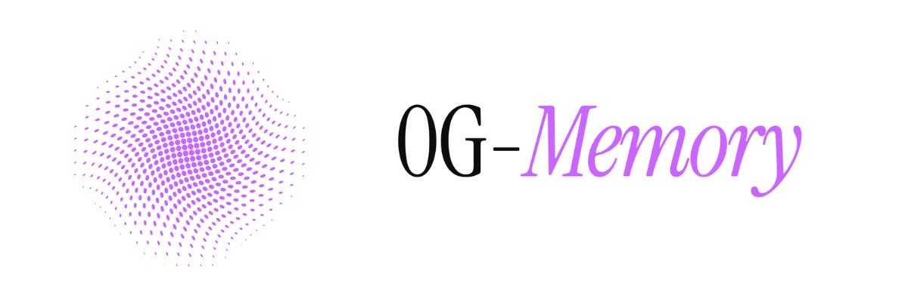

# 0G-Memory

> Persistent, verifiable memory for autonomous AI agents — backed by 0G Storage, powered by 0G Compute, settled on 0G Chain.

**0G-Memory** is a drop-in SDK that gives any AI agent cross-session memory with cryptographic proof. No databases. No vendor lock-in. Every memory write returns a Merkle root hash that anyone can verify on StorageScan.

**AgentBill** is the reference application — an autonomous invoicing agent that remembers clients across sessions, generates invoices via decentralized AI inference, archives them permanently on 0G Storage, and collects payments on 0G Chain.

---

## 0G Components Used

| Component | How Used |
|---|---|
| **0G Storage — KV** | Agent context and client history, fast reads across sessions |
| **0G Storage — Log** | Permanent invoice archival — immutable, Merkle-provable |
| **0G Compute Router** | AI inference for invoice generation (Llama 3.3 70B) |
| **0G Chain** | Payment escrow contract, invoice registration, on-chain settlement |

---

## Architecture

```
User Wallet (MetaMask)
        ↓
  AgentBill Frontend  (Next.js — Vercel)
        ↓
  AgentBill API       (Next.js API routes)
    ↙       ↓        ↘
0G-Memory  0G Compute  0G Chain
(KV + Log)  (Llama 70B)  AgentPayment.sol
    ↓                        ↓
StorageScan proof      ChainScan tx link
```

---

## SDK — Three Methods, Complete Memory

```ts
import { ZeroGMemory, deriveAgentId } from '0g-memory-sdk';

const { agentId } = deriveAgentId('my-agent', process.env.PRIVATE_KEY!);
const memory = new ZeroGMemory({ agentId, privateKey, rpcUrl, indexerRpc });

// Persist context across sessions
await memory.remember('client:acme', { budget: 50000, stack: 'TypeScript' });

// Recall from any machine, any session
const ctx = await memory.recall('client:acme');

// Archive permanently — returns StorageScan URL
const { rootHash, storageScanUrl } = await memory.archive({ type: 'invoice', data: invoice });
```

---

## Live Demo

**Frontend:** [0g-memory.vercel.app](https://0g-memory.vercel.app)

**Contract:** [`0x856bAd16e5459Ea9547390c75Ba12B132aA79A4a`](https://chainscan-galileo.0g.ai/address/0x856bAd16e5459Ea9547390c75Ba12B132aA79A4a)
**Network:** 0G Galileo Testnet (chainId: 16602)

---

## Local Setup

```bash
git clone https://github.com/anbusan19/0g-memory
cd 0g-memory
cp .env.example .env
# Fill in PRIVATE_KEY and OG_COMPUTE_API_KEY

pnpm install
pnpm --filter 0g-memory-sdk build
pnpm --filter agentbill dev
```

**You'll need:**
- OG tokens: https://faucet.0g.ai
- 0G Compute API key: https://pc.0g.ai

---

## Environment Variables

```bash
NEXT_PUBLIC_OG_RPC_URL=https://evmrpc-testnet.0g.ai
NEXT_PUBLIC_OG_CHAIN_ID=16602
OG_INDEXER_RPC=https://indexer-storage-testnet-standard.0g.ai
PRIVATE_KEY=your_agent_wallet_private_key
OG_COMPUTE_API_KEY=your_compute_api_key
OG_COMPUTE_BASE_URL=https://router-api.0g.ai/v1
NEXT_PUBLIC_PAYMENT_CONTRACT_ADDRESS=0x856bAd16e5459Ea9547390c75Ba12B132aA79A4a
```

---

## Repo Structure

```
packages/
├── 0g-memory-sdk/      # Drop-in agent memory SDK
│   ├── src/
│   │   ├── index.ts    # ZeroGMemory class — remember / recall / archive
│   │   ├── storage.ts  # 0G Storage KV + Log wrappers
│   │   ├── agentId.ts  # Deterministic agent ID derivation
│   │   └── types.ts
│   └── package.json
└── agentbill/          # Reference app — autonomous invoicing agent
    ├── contracts/
    │   └── AgentPayment.sol
    ├── src/
    │   ├── agent/      # invoice.ts · memory.ts · payment.ts
    │   └── app/        # Next.js frontend + API routes
    └── package.json
```

---

## Built for 0G APAC Hackathon 2026

`#0GHackathon` · `#BuildOn0G` · `@0G_labs` · `@HackQuest_`
